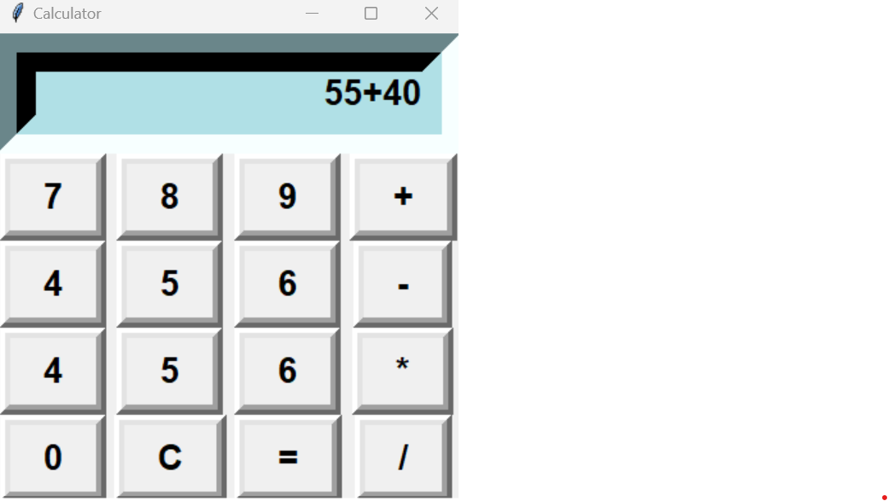
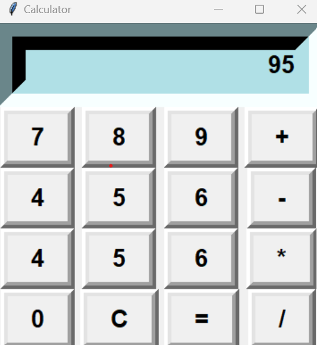

# Simple-GUI-Calculator

Creating Python Calculator GUI using Tkinter Visual Studio Code

We frequently use calculators we were thinking about how they were designed or what's underneath the hood. It's essential for us to think about these things if you want to become a better software developer. The best way to do so is by working on projects and putting your knowledge to use.

This project involves creating a simple calculator GUI using Python's Tkinter library in Visual Studio Code. The calculator will perform basic arithmetic operations such as addition, subtraction, multiplication, and division. The interface will include a display screen to show user input and results, and a grid of buttons for digits and operations. Users can click buttons to perform calculations interactively. Tkinter's layout management (like grid()) will be used for arranging the widgets. Visual Studio Code will serve as the IDE for writing and debugging the Python code. This project demonstrates GUI design, event handling, and Python programming basics

Example:

